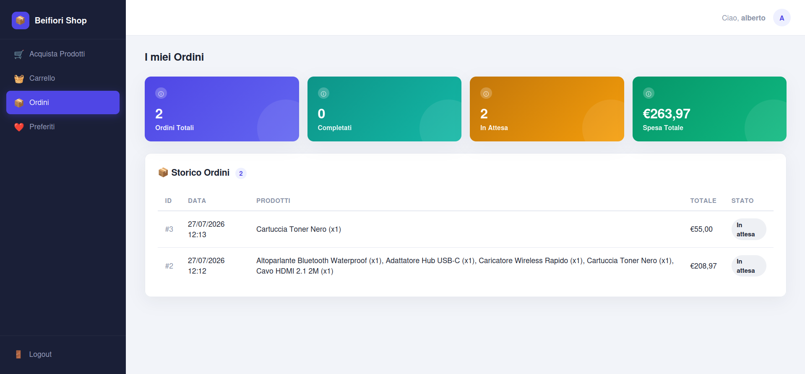
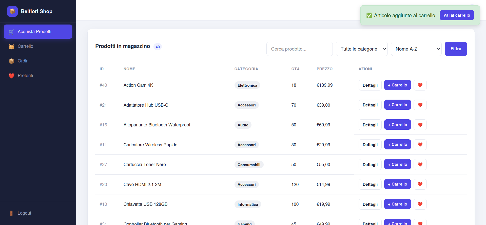

# 📦 Beifiori — Gestionale Magazzino & Negozio Online

Applicazione web full-stack in **PHP + MySQL** che unisce in un unico progetto:

- un **negozio e-commerce** rivolto ai clienti (catalogo, carrello, checkout, recensioni, preferiti, storico ordini);
- un **gestionale di magazzino** per gli amministratori (scorte, fornitori, budget aziendale, log movimenti, statistiche di vendita).

---

## 🖼️ Anteprima

Un primo sguardo all'interfaccia, lato cliente e lato amministratore.

### 🛍️ Area Cliente

Sezione prodotti acquistabili con possibilità di aggiunta al carrello o ai preferiti, con seguenti dettagli prima di confermare l'ordine
<p align="center">
  
  
</p>

### 🛠️ Area Amministratore

Gestione magazzino: ricerca, filtro categoria, **ordinamento per nome/prezzo/quantità**, modifica limitata (nome, descrizione, riduzione scorte, nuovo prezzo), eliminazione, evidenziazione automatica delle scorte sotto soglia, **export CSV**.
<p align="center">
  
</p>

Elenco utenti con numero ordini e spesa totale; promozione/retrocessione ruolo admin↔user, eliminazione account
<p align="center">
  
  
</p>

---

## ✅ Requisiti

Per eseguire l'app hai due strade:

1. **Docker Desktop** (consigliata, ambiente identico per tutti — vedi sotto)
2. **Ambiente locale manuale**: PHP ≥ 8.1 con estensione `pdo_mysql`, server MySQL/MariaDB, un web server (Apache/Nginx) o il server integrato di PHP

---

## 🐳 Installazione con Docker Desktop (Windows)

Questa sezione spiega **solo l'installazione di Docker Desktop**: per l'avvio dell'app usa i tuoi file `Dockerfile` / `docker-compose.yml` già pronti, seguendo i comandi nella sezione successiva.

### 1. Requisiti di sistema

- Windows 10 64-bit, versione 19041 o superiore (build **19041+**), oppure Windows 11
- Virtualizzazione hardware **abilitata nel BIOS/UEFI** (di solito già attiva di default)
- Almeno 4 GB di RAM disponibili per Docker

### 2. Abilita WSL2 (Windows Subsystem for Linux)

Apri **PowerShell come Amministratore** ed esegui:

```powershell
wsl --install
```

Riavvia il PC quando richiesto. Se WSL era già installato, aggiorna il kernel Linux con:

```powershell
wsl --update
```

### 3. Scarica e installa Docker Desktop

1. Vai su **[docker.com/products/docker-desktop](https://www.docker.com/products/docker-desktop/)**
2. Scarica **Docker Desktop for Windows**
3. Avvia l'installer e lascia selezionata l'opzione **"Use WSL 2 instead of Hyper-V"**

### 4. Primo avvio

1. Apri **Docker Desktop** dal menu Start
2. Attendi che in basso a sinistra compaia l'indicatore verde **"Engine running"**
3. Se richiesto, accetta i termini di servizio (non serve un account a pagamento per uso locale)

### 5. Verifica l'installazione

Apri un terminale (PowerShell o CMD) e lancia:

```powershell
docker --version
docker compose version
```

Se entrambi i comandi restituiscono un numero di versione senza errori, Docker è pronto per far girare il progetto.

> 💡 In alternativa a Windows puoi usare **WSL2 con Ubuntu** e installare Docker direttamente lì, oppure Docker Desktop per Mac/Linux: i comandi della sezione successiva sono identici su tutti i sistemi.

---

## 🚀 Avvio del progetto

Con Docker Desktop avviato:

```bash
# 1. Posizionati nella cartella del progetto
cd percorso/della/cartella/progetto

# 2. Build delle immagini e avvio dei container in background
docker compose up -d --build

# 3. Controlla che tutti i container siano "Up"
docker compose ps
```

Apri poi il browser sulla porta esposta per il servizio web `http://localhost:8080`

### Comandi utili

```bash
# Vedere i log in tempo reale (utile per debug)
docker compose logs -f

# Fermare i container senza eliminare i dati
docker compose down

# Fermare e ripulire anche il volume del database (reset completo)
docker compose down -v
```

---

## 🔑 Primo utilizzo

1. Apri l'app nel browser e vai su **Registrati**
2. Compila i campi e spunta **"Registrati come Amministratore (solo per test)"** per creare subito un account admin
3. Effettua il login
4. Da lì puoi:
   - vedere tutte le funzionalità di gestione magazzino per amministratori
   - registrare un secondo utente **senza** la spunta admin, per testare il flusso cliente (catalogo → carrello → checkout)
5. Esplora dashboard, log movimenti e gestione ordini per vedere l'app popolarsi di dati reali

---

## 🩺 Risoluzione problemi comuni

| Problema | Possibile causa / soluzione |
|---|---|
| **Pagina bianca o errore 500** | Controlla i log del container web con `docker compose logs -f`; spesso è un errore PHP non catturato o l'estensione `pdo_mysql` mancante nell'immagine |
| **"SQLSTATE[HY000] [2002] Connection refused"** | Il container del database non è ancora pronto quando parte quello web: riavvia con `docker compose restart web`, oppure aggiungi un healthcheck/`depends_on` nel tuo `docker-compose.yml` |
| **"Access denied for user..."** | Le credenziali in `db.php` non coincidono con quelle definite nel tuo `docker-compose.yml`/variabili d'ambiente: verificale su entrambi i lati |
| **Porta già in uso (`port is already allocated`)** | Un altro servizio locale sta già usando quella porta: cambia il mapping (es. `"8081:80"`) nel tuo `docker-compose.yml` e riavvia |
| **Le modifiche a `style.css`/PHP non si vedono** | Fai un hard refresh del browser (`Ctrl+F5`) per svuotare la cache; se usi un volume Docker verifica che il file sia effettivamente montato e non "congelato" dentro l'immagine buildata |
| **Login non funziona / redirect loop** | Controlla che `session_start()` non generi warning (permessi cartella sessioni PHP) e che i cookie non vengano bloccati dal browser |
| **`docker: command not found`** | Docker Desktop non è avviato, oppure non è stato aggiunto al PATH: riapri l'app Docker Desktop e riprova da un nuovo terminale
